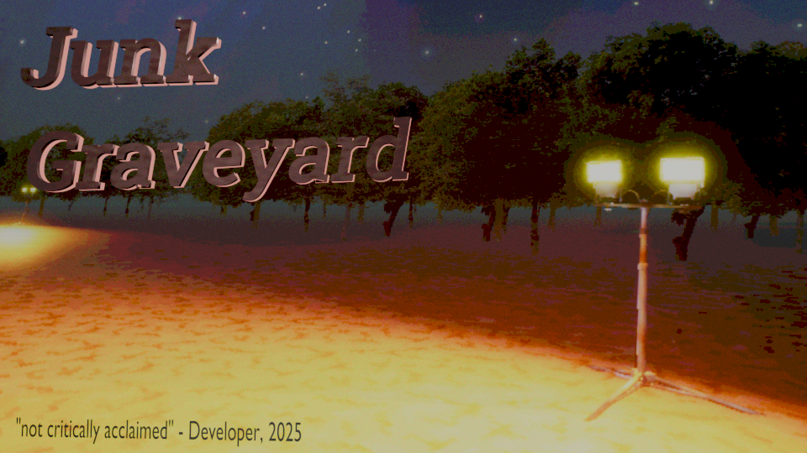

Junk Graveyard is a small indie-horror game about metal detecting for a profit to clear the dig site of its valuables. Made for [Hack Club Midnight](https://midnight.hackclub.com).

Release Date: Before 2026 Probably\
Clanker Usage: None\
Target Platforms: Windows, Linux if I get the cross-compiling toolchain to quit screwing around\
Itch.io: [https://zxmushroom63.itch.io/junk-graveyard](https://zxmushroom63.itch.io/junk-graveyard)

## Download
See the [itch.io page](https://zxmushroom63.itch.io/junk-graveyard)'s download section

## Build Instructions
1. Download Unreal Engine 4.27 for your system
2. Download / clone this repository
     - Use `--depth=1` to clone, there are large files in commit history
3. Open `DiggingGame.uproject` in UE 4.27
4. Select File > Package project > [Your Operating System]
5. Select a parent folder for the build
6. An executeable of the game should be created!